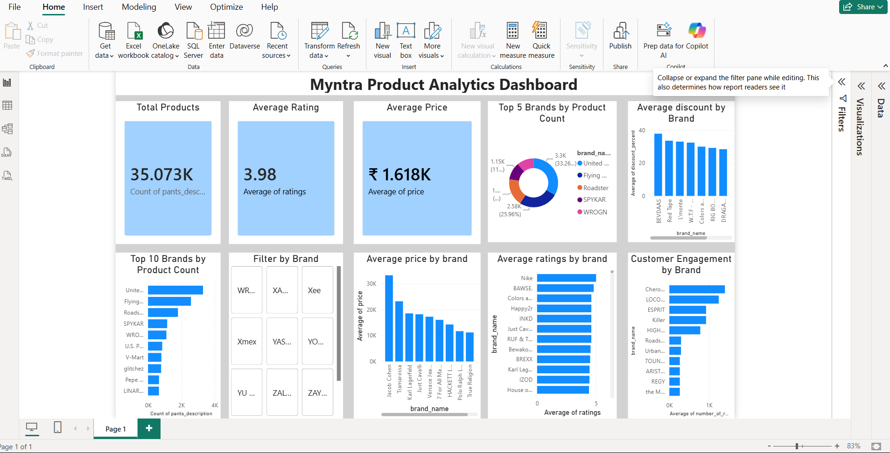

# Myntra Product Analytics Dashboard

##  Project Overview
This project analyzes over 52,000 Myntra product records using Python and Power BI. The objective was to clean the data, perform exploratory data analysis (EDA), and build an interactive dashboard to uncover insights into product pricing, discounts, ratings, and brand performance.

##  Tools & Technologies
- Python
- Pandas
- Matplotlib
- Power BI
- Google Colab
- GitHub

## Skills Demonstrated

- Data Cleaning
- Exploratory Data Analysis (EDA)
- Data Visualization
- Dashboard Development
- Business Intelligence
- Data Storytelling

##  Dashboard Features
- Total Products KPI
- Average Price KPI
- Average Rating KPI
- Top 10 Brands by Product Count
- Average Price by Brand
- Average Rating by Brand
- Average Discount by Brand
- Customer Engagement by Brand
- Interactive Brand Filter (Slicer)

##  Key Business Insights
- Identified brands with the largest product catalog.
- Compared average pricing across brands.
- Analyzed customer ratings and engagement.
- Evaluated discount strategies used by different brands.
- Built an interactive dashboard for easy business analysis.

##  Dashboard Preview

##  Project Files
- Myntra_Product_Analytics.pbix
- Myntra_Product_Analysis.ipynb
- Cleaned_Myntra_Dataset.csv

##  How to Run

1. Download the repository.
2. Open `Myntra_Product_Analytics.pbix` in Power BI Desktop.
3. Open `Myntra_Product_Analysis.ipynb` in Google Colab or Jupyter Notebook.
4. Use the provided dataset to explore the analysis.

##  Project Outcome

Developed an interactive dashboard that enables users to analyze product pricing, ratings, discounts, customer engagement, and brand performance through dynamic visualizations and filters.

##  Author
Bhavya Sri Jakkidi 
